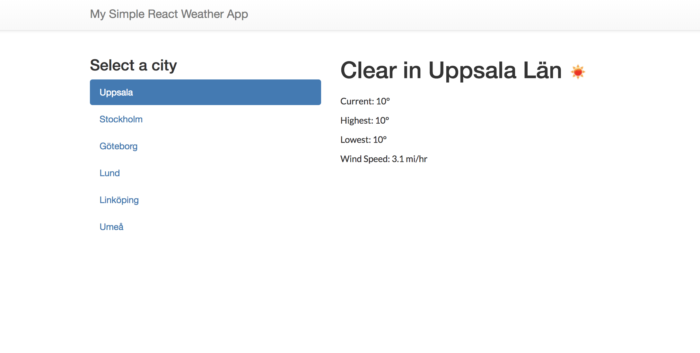
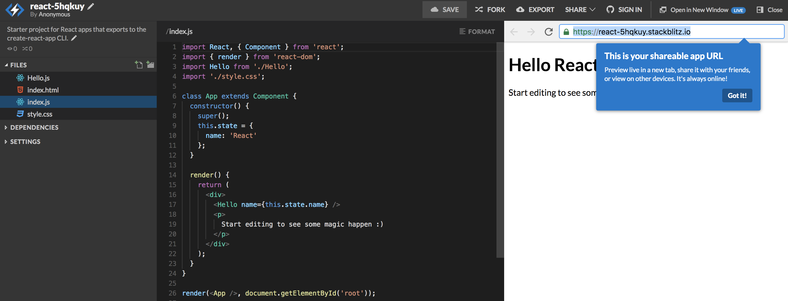
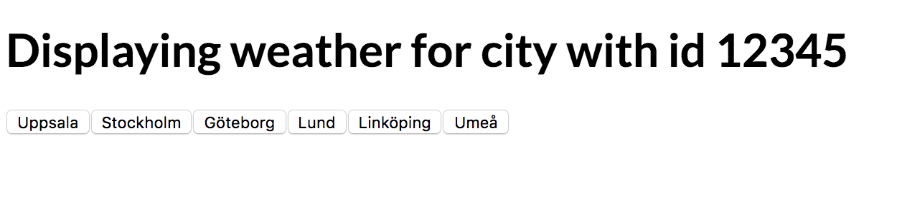
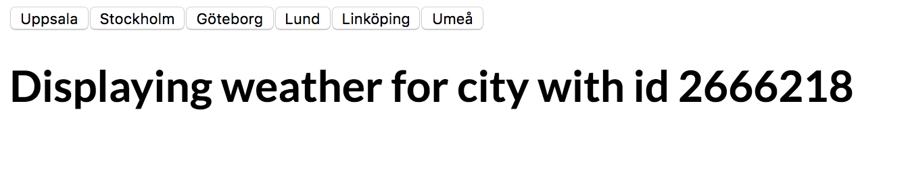
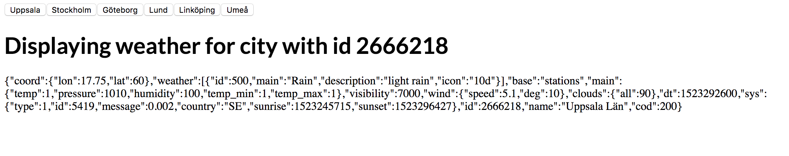
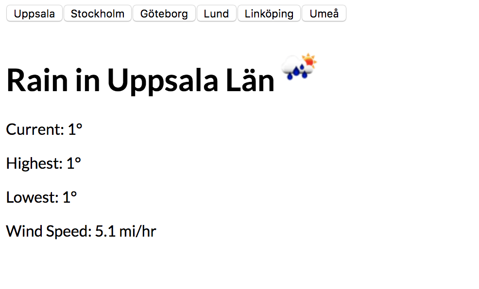
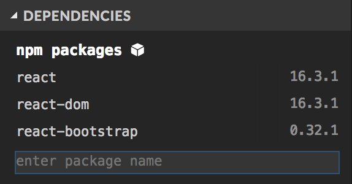

# React intro workshop DV/IT 2018

This workshop was developed for a React intro-workshop and is inspired by a similar workshop done as part of Facebook's 2017 developer conference, F8.

By the end of the workshop, we will have a simple production-ready weather app.



# Create your first app

To save some time, we'll not set up a local development environment but will instead rely on a hosted one.
Visit [Stackblitz](https://stackblitz.com/) which is an online IDE for web applications.

Here we'll choose React with ES6 and soon you will see that your new app has been loaded in a preview window next to an editor!


# Components and Props

Lets take a look at the basic app that was generated for us. In `index.js`. The app currently looks like this:

```js
class App extends Component {
  constructor() {
    super()
    this.state = {
      name: 'React',
    }
  }

  render() {
    return (
      <div>
        <Hello name={this.state.name} />
        <p>Start editing to see some magic happen :)</p>
      </div>
    )
  }
}
```

Our whole app starts with this file, and the render function is at the heart of it. Try modifying some text, save, and watch the app automatically show those changes!

You might also have noticed that we have a unknown element inside our div, another component called `<Hello>` was also generated for us but lets ignore that for now (you can even remove that line from the code if you want).

## Part 1 - New component

Now lets go ahead and make a new component, `WeatherDisplay`. Since this is an entirely new file we first have to import React and Component in the same way as in index.js, we also have to export the component in order to make it accessible from other files. The render function, that we mentioned earlier, is the heart of a component because it defines what will be displayed. For now, lets just display a `<h1>` HTML tag, with some text inside.

```js
import React, { Component } from 'react'
export default class WeatherDisplay extends Component {
  render() {
    return <h1>Displaying weather for some city</h1>
  }
}
```

Lets modify our App component (index.js) to use our new and shiny WeatherDisplay component.

```js
import WeatherDisplay from './WeatherDisplay';
class App extends Component {
  render() {
    return (
      <div className="App">
        <WeatherDisplay />
      </div>
    )
  }
}
```

You should now see the text you wrote inside the WeatherDisplay component appear in the preview window. You now have two components, one nested within the other!

## Part 2.1 - Passing down props

In order to make our WeatherDisplay component a bit more useful we can give it some more information about what we want it to display. In this case we might want to pass down information about which `cityId` we want information for, lets start with a fake one.

```js
class App extends Component {
  render() {
    return (
      <div className="App">
        <WeatherDisplay cityId={'12345'} />
      </div>
    )
  }
}
```

As you can see, we now added some information to the line where we use the `WeatherDisplay` component. This data is a prop named "cityId". In order to make use of this data that is now sent down to WeatherDisplay, we can modify our `WeatherDisplay`-components render method to display the data being passed in:

```js
export default class WeatherDisplay extends Component {
  render() {
    return <h1>Displaying weather for city with id {this.props.cityId}</h1>
  }
}
```

## Part 2.2 - Passing down props
Lets go back to our App component in index.js and near the top of the file, add some different places that we might want to display weather for:

```js
const PLACES = [
  { name: 'Uppsala', id: '2666218' },
  { name: 'Stockholm', id: '2673722' },
  { name: 'Göteborg', id: '2711533' },
  { name: 'Lund', id: '2693678' },
  { name: 'Linköping', id: '2694759' },
  { name: 'Umeå', id: '602149' },
]
```

Now, upgrade the render function to iterate over each place, and render a `<button>` tag for it.
The brackets you see around `{PLACES.map()}` tells React to run this code before actually rendering anything, so in the case below we will go through each item in the `PLACES` array and for every `place` we will create a button.

```js
return (
  <div className="App">
    <WeatherDisplay cityId={'12345'} />
    {PLACES.map((place, index) => (
      <button
        key={index}
        onClick={() => {
          console.log('Clicked on index ' + index)
        }}
      >
        {place.name}
      </button>
    ))}
  </div>
)
```

As mentioned briefly above, we are creating an array of clickable button-elements in the component and then rendering that, the `key` prop is used to tell React the order of the elements in the array.

There is also an `onClick` event handler for each button, where we log any click to the console. You can see the log statements by opening the "Developer Tools" in your browser (or press "Console" in the bottom of the preview window). Your app should now look like this:



## Part 3 - Adding state

We want our app to be able to switch between places, so we can use state to keep that data in our App component.

When we created our app we already received a constructor but we have not actually used it to set a state yet. Lets give our app an initial state for `activePlace` in the constructor by adding this to `this.state`.

```js
constructor() {
  super();
  this.state = {
    activePlace: 0,
  };
}
```

When the app is first started, activePlace will now be set to 0. Our `render` function can use the data from `this.state` when declaring the UI. To change state, we can use the React component's `setState` method, which will change the state and re-run the render function to get the new UI.

Let's use the `this.state` and `this.setState` in our App component:

```js
class App extends Component {
  constructor() {
    super()
    this.state = {
      activePlace: 0,
    }
  }

  render() {
    const activePlace = this.state.activePlace
    return (
      <div>
        {PLACES.map((place, index) => (
          <button
            key={index}
            onClick={() => {
              this.setState({ activePlace: index })
            }}
          >
            {place.name}
          </button>
        ))}
        <WeatherDisplay key={activePlace} cityId={PLACES[activePlace].id} />
      </div>
    )
  }
}
```


At this point, [your `index.js` file should look something like this](./snapshots/part3_state/index.js).

## Part 4 - Lifecycle Methods and Data Fetching

Sometimes we want to add code that gets called at certain times in our component's lifetime. This is where the _lifecycle_ methods comes in to play.

In this example, we want to make an API call when the component first shows up on screen, so we will add code to a method called `componentDidMount`. Lets add the following snippet to our `WeatherDisplay` component, just above the render method:

```js
componentDidMount() {
  const cityId = this.props.cityId;
  const URL = "https://api.openweathermap.org/data/2.5/weather?id=" + cityId + "&appid=a9541640d21304988f5a84de4bea6e50&units=metric"
  fetch(URL).then(res => res.json()).then(json => {
    console.log(json)
  });
}
```

As soon as the WeatherDisplay component is mounted (when you click a button WeatherDisplay is actually re-mounted), the `componentDidMount` function will run and we will do a request using `fetch` and get some data back which we log to the console.

Now its time to actually do something with the data we receive. Lets start by adding a state to the WeatherDisplay component in the same way as we did with our first App component:

```js
constructor() {
  super();
  this.state = {
    weatherData: null
  };
}
```

Now that we have a state in the component, we also want to change the state when we have fetched some data. Replace the `console.log(json)` function that you added before with the following:
```js
this.setState({ weatherData: json });
```

This will actually change the state of the component when we have fetched some data to display, but what will happen if the request fails or is slow? Then the weatherData field will be null which is less than ideal. Lets update our render method a bit to both handle this case and to display the data that we fetch:

```js
render() {
  const weatherData = this.state.weatherData;
  if (!weatherData) return <div>Loading...</div>;
  return <div>
  <h1>Displaying weather for city {this.props.cityId}</h1>
  {JSON.stringify(weatherData)}
  </div>;
}
```

Now we are successfully fetching data and displaying what we receive in our app, at this point, [your `WeatherDisplay.js` file should look like this](./snapshots/part4_lifecycle_and_fetch/WeatherDisplay.js).

And this should be the result 

## Part 5 - Making it look OK

Lets organize that data a bit to make it more readable and more like a proper website. If we look at the data we print out, this is a standard [JSON-object](https://en.wikipedia.org/wiki/JSON) and it looks something like this:

```JSON
{"coord":{"lon":17.75,"lat":60},"weather":[{"id":800,"main":"Clear","description":"clear sky","icon":"01d"}],"base":"stations","main":{"temp":0.6,"pressure":1038.33,"humidity":63,"temp_min":0.6,"temp_max":0.6,"sea_level":1041.65,"grnd_level":1038.33},"wind":{"speed":2.51,"deg":38.5049},"clouds":{"all":0},"dt":1523382220,"sys":{"message":0.0025,"country":"SE","sunrise":1523331934,"sunset":1523382976},"id":2666218,"name":"Uppsala Län","cod":200}
```

This JSON is actually what we right now set our state to and have put into the variable `weatherData` inside our render method. We want to use only the information that lies within the `weather`-part of the object and can therefore add `const weather = weatherData.weather[0];` to our render method to make the code easier to follow.

Now that we have all data we want to use conveniently stored in our `weather` variable, lets go ahead and edit the `render` function some more to make better use of that data.

```js
const weather = weatherData.weather[0];
const iconUrl = "https://openweathermap.org/img/w/" + weather.icon + ".png";
return (
  <div>
    <h1>
      {weather.main} in {weatherData.name}
      
    </h1>
    <p>Current: {weatherData.main.temp}°</p>
    <p>Highest: {weatherData.main.temp_max}°</p>
    <p>Lowest: {weatherData.main.temp_min}°</p>
    <p>Wind Speed: {weatherData.wind.speed} mi/hr</p>
  </div>
);
```



At this point, [your `WeatherDisplay.js` file should look like this](./snapshots/part5_json_data/WeatherDisplay.js).

# Part 6 - Making it look better (and adding a dependecy)!

Our app is still somewhat ugly. We can fix that by styling everything with CSS or we can take a shortcut by installing a library called Bootstrap.

[Bootstrap](http://getbootstrap.com/) is popular UI toolkit for HTML and CSS that allows us to easier build up responsive web-pages. Since we are using Stackblitz we have to install Bootstrap in a bit of a weird way so follow these steps;

In the left-hand menu, right under the file tree you will find a section called Dependencies.
In the field that reads "enter package name" we'll first enter, `react-bootstrap`. This will install a package that allows us to use bootstrap within our react components. In order to get this to work we will also have to update our already existing libraries. So go ahead and also enter the following package names: `react` and `react-dom`




Now in order to actually use the CSS from bootstrap we have to add a lines to our `index.html` as well;

```html
<!-- Import stylesheets from bootstrap -->
<link rel="stylesheet" href="https://maxcdn.bootstrapcdn.com/bootstrap/3.3.7/css/bootstrap.min.css" integrity="sha384-BVYiiSIFeK1dGmJRAkycuHAHRg32OmUcww7on3RYdg4Va+PmSTsz/K68vbdEjh4u" crossorigin="anonymous">
```

Now that we have all the dependencies installed and bootstraps CSS imported we need to import the components we want to use from `react-bootstrap`. You can find all available components on the [react-bootstrap site](https://react-bootstrap.github.io/components.html).

```js
import { Navbar, NavItem, Nav, Grid, Row, Col } from "react-bootstrap";
```

Now, replace the App component's render function to use the bootstrap components:

```js
<div>
  <Navbar>
    <Navbar.Header>
      <Navbar.Brand>
        My Simple React Weather App
      </Navbar.Brand>
    </Navbar.Header>
  </Navbar>
  <Grid>
    <Row>
      <Col md={4} sm={4}>
        <h3>Select a city</h3>
        <Nav
          bsStyle="pills"
          stacked
          activeKey={activePlace}
          onSelect={index => {
            this.setState({ activePlace: index });
          }}
        >
          {PLACES.map((place, index) => (
            <NavItem key={index} eventKey={index}>{place.name}</NavItem>
          ))}
        </Nav>
      </Col>
      <Col md={8} sm={8}>
        <WeatherDisplay key={activePlace} cityId={PLACES[activePlace].id} />
      </Col>
    </Row>
  </Grid>
</div>
```

You should now be arriving at the final solution and have a fully functional, somewhat styled weather app!

